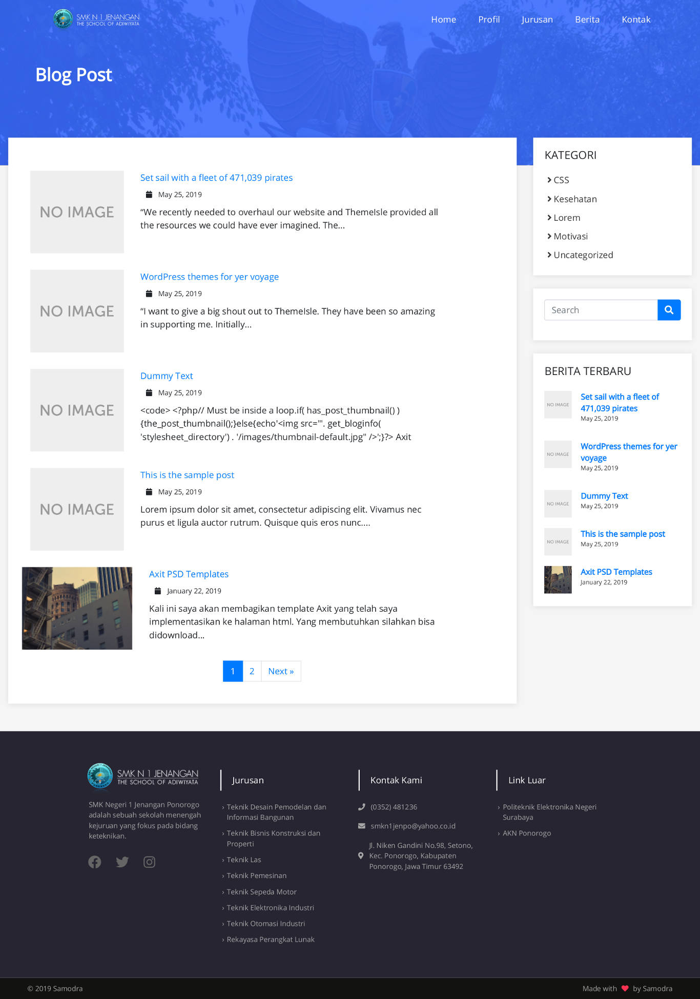
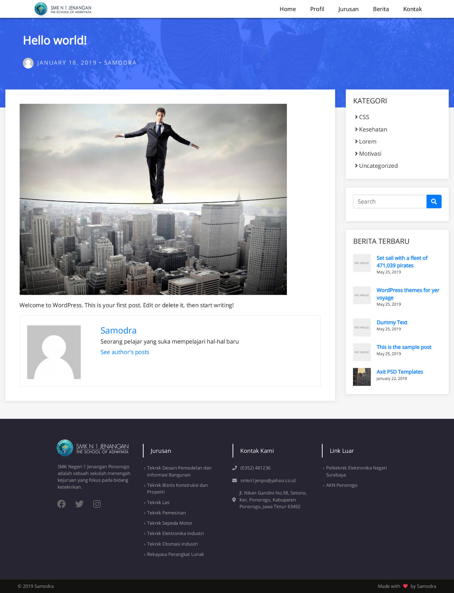

# SZS School Wordpress Theme
SZS School Wordpress Theme

**Theme version:** 1.0.1  
**Tested with wordpress version:** 5.2.1  
**License:** MIT License  

## Description ##
SZS is a modern WordPress theme for professionals. It fits portfolios, schools, and freelancers. The theme is responsive. Compatible with mobile, tablet and desktop device.

## Preview ##

### Blog Page ###

### Single Post Page ###

## How to use this theme ##
1. Upload this theme folder in your <code>wp-content/themes</code> directory. 
2. Active this theme with wordpress admin <code>Appearance/Themes/SZS</code>.   
3. Customize navbar and the others component first.  
4. Your theme is ready to use.  

## Copyright ##
SZS Wordpress Template, Copyright 2019 Samodra. SZS is distributed under the terms of MIT License

## Changelog ##
### 1.0.1 - 2019-05-27 ###
* Removing bug of front-page style
* Adding the dynamic title
* Adding preview in readme